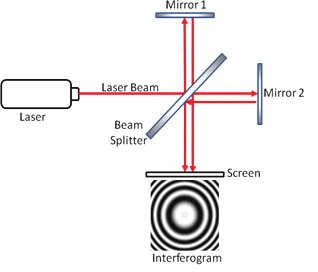

# Michelson Interferometer

The Michelson interferometer is a common configuration for optical interferometry and was invented by the American physicist Albert Abraham Michelson in 1887. Using a beam splitter, a light source is split into two arms. Each of those light beams is reflected back toward the beamsplitter which then combines their amplitudes using the superposition principle. The resulting interference pattern that is not directed back toward the source is typically directed to some type of photoelectric detector or camera. For different applications of the interferometer, the two light paths can be with different lengths or incorporate optical elements or even materials under test. — _Wikipedia_.

 

## Overview 

In this experiment we want to find
