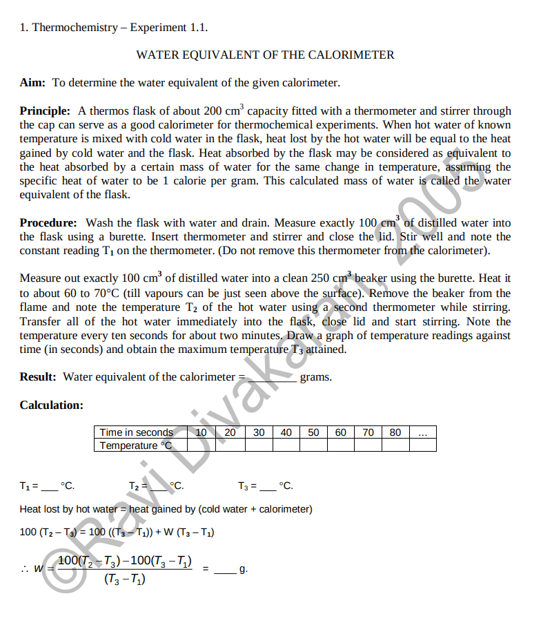

# Specific Heat Of Solids

The aim of the specific heat experiment is to determine the specific heat capacity of a given solid by applying the principle of calorimetry. A heated solid is immersed in water contained in a calorimeter, and the final equilibrium temperature is measured. Using the principle of conservation of energy, that heat lost by the hot body equals heat gained by water and the calorimeter, the specific heat capacity of the material is calculated.

# Documentation

A sufficiently complete description of the methods of this experiment can be found <a href="https://sites.iiserpune.ac.in/~bhasbapat/phy221_files/Sp.%20heat%20of%20solids.pdf">here.</a> This document is by Prof. Bhas Bapat of IISER Pune from when he used to coordinate the lab course. Additionally, this document contains detailed interpretation and analysis sections as well. The document can be found on the doc folder too, in case the link is inactive in the future.

It's a very simple experiment, the analysis also is straight forward application of the two central formulas : one for calculating the equivalent mass of the dewar, and another for calculating specific heat. The former is not mentioned in my version of the lab manual so I will attach some information regarding that underneath. The error analysis is simply standard error propagation of the above mentioned formulas.

# Water Equivalent of Dewar

 

